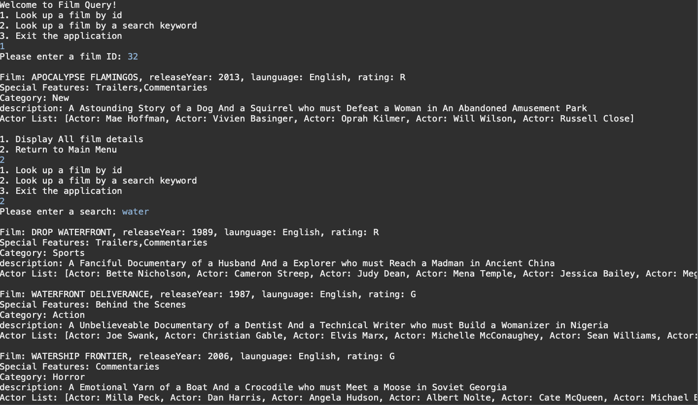

# FilmQueryProject

### Description 

This application is a film search application. It utilizes the SDvid database which has films and all the info about the films stored into it. The application uses ORM with the use of SQL and JDBC to retrieve database records and store them in a Java object. This allowed the creation of this application that allows a user to search for a film by the ID or a keyword that is in the films description or title. If the use chooses to search by ID a single film is displayed with its info, then the user can choose to display all the information available about that film or go back to the main menu. If the user searches by a keyword, all films that match the keyword will be displayed to the user. If either the Id or the keyword don't match the search, the user is displayed with a message letting them know that no films were found under the search criteria that they entered. 

### Technologies 
- Eclipse IDE 
- SQL
- MySql
- Git
- Java 
	- Version: 1.8
	
The use of ORM allowed the creation of the application. Using SQL and JDBC to access the database to map the database records to a Java object.  	 

### What I learned

This projects truly opened the doors to programming for me. I have been able to understand the main concepts and logic behind java and OOP, but introducing the use of databases and SQL just opens the door to so many different ideas and concepts to build really cool things. This really helped my understanding with using SQL and MySql, with properly setting queries to get the information that you need, whether this is pulling information from one table, or joining multiple tables to get all the information that you need for your program. 

Along with solidifying some SQL know how, this really helped me piece together using SQL and Java by creating a ORM. Its as simple as modeling your object to "take the same form" as your database table. Then using JDBC, the objects fields then can simply be populated from database records that match the query your looking for. 

### Sample of Application 

